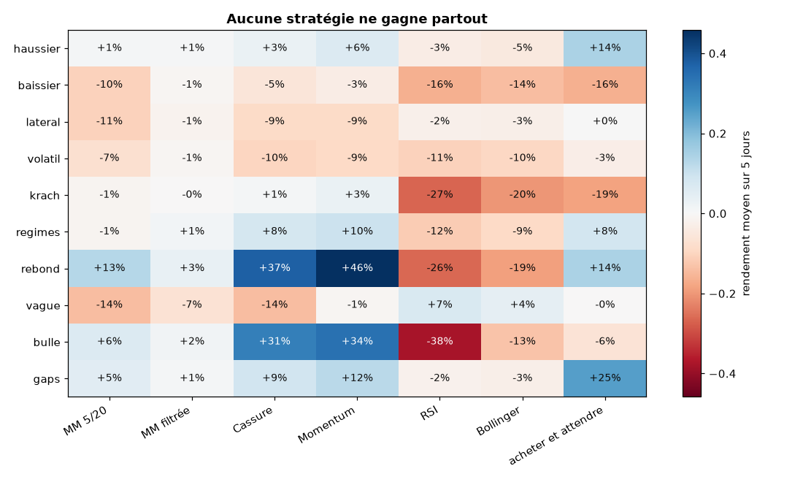
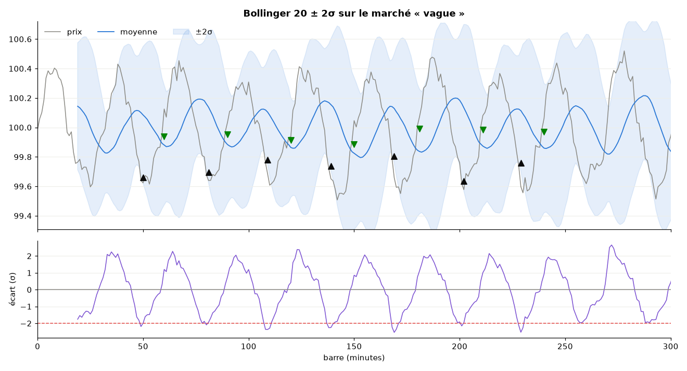

# algoTrade

Algorithme de scalping par **croisement de moyennes mobiles**, connecté au courtier
[Alpaca](https://alpaca.markets). Avant de trader, on peut **backtester** la stratégie sur
des marchés simulés ou réels, et **simuler le bot** en accéléré, sans clé API.

> ⚠️ Projet éducatif. Le trading comporte un risque de perte en capital. Par défaut,
> le programme utilise le **compte de démonstration** d'Alpaca et **n'envoie aucun ordre**.

## Installation

```sh
pip install -r requirements.txt
cp .env.example .env      # puis renseigner ALPACA_API_KEY et ALPACA_SECRET_KEY (facultatif)
```

## Utilisation

```sh
# Sans clé API
python main.py cas                               # cas illustrés sur 5 marchés simulés
python main.py cas --graphique                   # ... avec les graphiques
python main.py backtest --scenario krach --transactions --graphique
python main.py backtest --csv mes_prix.csv       # vos propres données (open,high,low,close,volume)
python main.py simulation --scenario lateral     # le bot en accéléré, avec coupe-circuit

# Le laboratoire : 14 cas illustrés, 7 stratégies, 10 marchés simulés
python main.py cas --liste                       # les cas illustrés
python main.py cas --nom strategies --nom frais  # cas précis (répétable)
python main.py cas --tout --sauver figures       # tous les cas, figures enregistrées
python main.py comparer --scenario regimes       # toutes les stratégies sur un marché
python main.py montecarlo --scenario lateral --graines 100 --strategie rsi
python main.py backtest --scenario vague --strategie bollinger --transactions

# Avec clés API (compte de démonstration par défaut)
python main.py compte                            # capital, liquidités, pouvoir d'achat
python main.py selection                         # action la plus échangée du jour (> 5 $)
python main.py backtest --symbole AAPL --jours 5 # backtest sur l'historique réel
python main.py bot --symbole AAPL                # bot en direct, À BLANC (journal seulement)
python main.py bot --symbole AAPL --envoyer-ordres
```

Réglages communs : `--strategie` (`mm`, `mm_filtre`, `cassure`, `momentum`, `rsi`, `bollinger`, `tenir`),
`--court 5 --long 20` (moyennes mobiles), `--fenetre` (autres stratégies), `--stop 1` (stop-loss en %),
`--objectif 2` (take-profit en %). Pour le bot : `--budget`, `--quantite`, `--perte-max`.

## La stratégie

- **Achat** quand la moyenne mobile courte **croise** la longue par le haut.
- **Vente** quand elle repasse dessous, ou au **stop-loss** / **take-profit**.
- Une seule position à la fois et jamais de vente à découvert.

## Cas illustrés : que vaut vraiment ce scalping ?

`python main.py cas` joue la stratégie sur 5 jours de barres d'une minute
(capital 10 000 $, frais 0,05 % par ordre, glissement 0,02 %) :

| Marché | Buy & hold | Scalping MM 5/20 | Sans frais | Plus lent (MM 15/60) | Trades |
|---|---:|---:|---:|---:|---:|
| haussier | +5.4 % | −4.5 % | +3.5 % | +2.4 % | 58 |
| baissier | −22.8 % | −14.1 % | −7.3 % | −7.2 % | 54 |
| latéral | +0.8 % | −13.2 % | −4.3 % | −10.3 % | 70 |
| volatil | −20.3 % | −15.7 % | −8.7 % | +1.9 % | 57 |
| krach | −24.9 % | −5.5 % | +0.3 % | −0.7 % | 43 |

Ce qu'on en retient :

- **Protection dans les baisses** : pendant le krach, la stratégie sort vite du marché et
  perd 5,5 % au lieu de 25 %.
- **Le marché latéral est le pire cas** : les moyennes se croisent sans arrêt, et chaque faux
  signal coûte des frais.
- **Les frais pèsent lourd** : 50 à 70 allers-retours par semaine, c'est ce qui sépare la
  colonne « Scalping » de la colonne « Sans frais ».
- **Aucun réglage ne gagne partout.** Testez sur vos données (`--csv`, `--symbole`) et
  plusieurs graines (`--graine`) avant de risquer de l'argent.

### Krach : la stratégie reste à l'abri


### Marché latéral : les faux signaux s'accumulent


## Le laboratoire : 14 cas illustrés

Chaque chiffre est calculé par un backtest (frais 0,05 % et glissement 0,02 % par ordre sauf mention
contraire). `python main.py cas --tout --sauver figures` rejoue tout en environ une minute.

| Cas | Ce qu'il montre |
|---|---|
| `marches` | le cas d'origine ci-dessus (MM 5/20 sur 5 marchés) |
| `nouveaux_marches` | cinq marchés de plus : `regimes`, `rebond`, `vague`, `bulle`, `gaps` |
| `strategies` | 6 stratégies × 10 marchés : trois stratégies différentes gagnent quelque part, **aucune partout** |
| `echelle` | la même oscillation est un retour à la moyenne (RSI/Bollinger gagnent) pour des périodes de 10 à 30 min et une tendance (MM/cassure gagnent) de 45 à 150 min |
| `frais` | seuil de rentabilité par dichotomie : 0,15 % par ordre pour un momentum, 0,01 % pour la MM 5/20 |
| `reglages` | grilles court × long : le meilleur couple change avec le marché (5/60, 12/30, 2/10) |
| `surapprentissage` | optimiser sur la 1re moitié, juger sur la 2e : le réglage « optimal » déçoit dans 9 cas sur 10 |
| `monte_carlo` | 50 graines : la MM a 0 % de chances de gagner en latéral ; le momentum gagne dans 100 % des marchés à régimes |
| `risque` | stop-loss, take-profit et leur garantie : le stop à −1 % coûte en moyenne −1,14 %, jusqu'à −2,3 % |
| `taille` | la taille de position règle l'échelle du risque, pas la qualité ; fraction de Kelly |
| `regimes` | le filtre de tendance (ratio d'efficacité de Kaufman) évite les faux signaux hors tendance |
| `metriques` | Sharpe, Sortino, Calmar, drawdown, espérance, exposition, recalculés à la main |
| `bot` | le coupe-circuit sur un krach, mode à blanc, toutes les stratégies dans le bot |
| `anatomie` | la raison écrite de chaque décision, tracée sur le prix |

### Qui gagne où ?



### Pourquoi RSI et Bollinger achètent là



## Les stratégies (`strategies.py`)

Toutes ont la même interface que le croisement de moyennes mobiles : une fonction pure du passé des
prix, utilisée à l'identique par le backtest et le bot.

| Nom | Famille | Idée |
|---|---|---|
| `mm` | tendance | croisement de moyennes mobiles 5/20 (la stratégie d'origine) |
| `mm_filtre` | tendance | idem, mais seulement si le ratio d'efficacité de Kaufman montre une direction |
| `cassure` | tendance | achat au-dessus du plus haut des 20 dernières barres (canal de Donchian) |
| `momentum` | tendance | on suit ce qui a monté de plus de 0,3 % sur 30 barres |
| `rsi` | retour à la moyenne | achat des survendus (RSI < 30), vente au retour à 55 |
| `bollinger` | retour à la moyenne | achat sous la bande basse, vente au retour sur la moyenne |
| `tenir` | référence | acheter et attendre, avec les mêmes frais |

## Les marchés simulés (`donnees.py`)

Cinq marchés d'origine (`haussier`, `baissier`, `lateral`, `volatil`, `krach`, inchangés à la décimale
près) et cinq nouveaux : `regimes` (alternance de tendances et d'absence de direction, étiquettes dans
`df.attrs["regimes"]`), `rebond` (chute puis remontée en V), `vague` (oscillation de période réglable),
`bulle` (accélération puis éclatement), `gaps` (écart à l'ouverture chaque matin).

## Garde-fous du bot

| Garde-fou | Comportement |
|---|---|
| Mode à blanc | Sans `--envoyer-ordres`, le bot écrit ce qu'il ferait, sans rien envoyer |
| Compte de démonstration | Actif tant que `ALPACA_PAPER` n'est pas à `false` ; le compte réel demande de taper « JE CONFIRME » |
| Budget | La quantité est calculée pour ne pas dépasser `--budget` |
| Coupe-circuit | Arrêt si le capital baisse de plus de `--perte-max` % (3 % par défaut) |
| Robustesse | Une erreur réseau est journalisée et le bot continue ; Ctrl-C l'arrête proprement |
| Marché fermé | Le bot attend l'ouverture au lieu d'envoyer des ordres |

## Organisation du code

| Fichier | Rôle |
|---|---|
| `main.py` | ligne de commande (`cas`, `backtest`, `simulation`, `compte`, `selection`, `bot`) |
| `scalp_strategy.py` | la stratégie d'origine, une fonction pure utilisée à l'identique en backtest et en direct |
| `strategies.py` | le catalogue : MM filtrée, cassure, momentum, RSI, Bollinger, acheter-et-garder |
| `backtest.py` | rejeu avec frais, glissement et fraction engagée, sans lecture de l'avenir ; métriques (Sharpe, Sortino, Calmar, exposition, espérance...) et graphiques |
| `analyses.py` | Monte-Carlo, seuil de rentabilité en frais, grilles de réglages, surapprentissage, Kelly, régimes |
| `cas.py`, `illustrations.py` | les 14 cas illustrés et leurs figures |
| `donnees.py` | marchés simulés (10 scénarios), CSV, historique Alpaca |
| `alpaca_connect.py` | courtier Alpaca (SDK `alpaca-py`) et courtier simulé, avec la même interface |
| `trade_volume.py` | choix de l'action la plus active (screener Alpaca), hors penny stocks |
| `bot.py` | boucle de trading et garde-fous |
| `config.py` | clés lues dans l'environnement ou `.env`, jamais dans le code |
| `test_algotrade.py`, `test_laboratoire.py` | 94 tests hors ligne (`python -m pytest -q`, environ 35 s) |

## Ce qui a changé par rapport à la première version

- Les trois scripts ne pouvaient pas s'exécuter : ils utilisaient des variables définies
  dans d'autres fichiers (`api`, `np`, `time`, `selected_stock`).
- `get_barset` n'existe plus dans l'API Alpaca. Le code utilise maintenant le SDK officiel `alpaca-py`.
- L'ancien code rachetait 10 actions **chaque minute** tant que la MM courte restait
  au-dessus de la longue, et pouvait vendre à découvert sans le vouloir. Il n'agit plus
  qu'aux croisements, et ne vend que ce qu'il détient.
- Les ordres au marché étaient en `gtc`. Ils sont maintenant valables pour la journée (`day`).
- Les clés API ne sont plus écrites dans le code.
- La sélection d'action ne demande plus les barres de milliers de symboles du NASDAQ.
  Elle utilise le screener d'Alpaca et écarte les actions à moins de 5 $.
